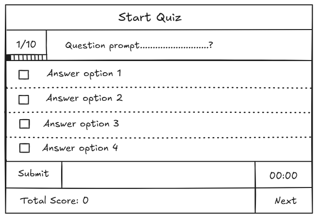
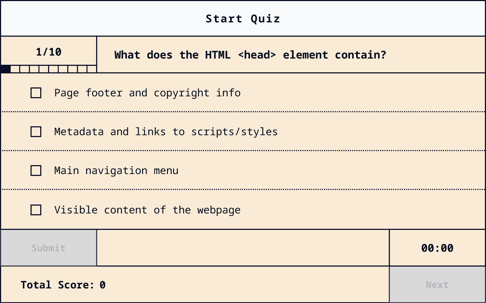

# 🎯 Vanilla JavaScript Quiz Application

A modern, interactive quiz application built with vanilla JavaScript, featuring a clean modular architecture, real-time timer, answer shuffling, and comprehensive accessibility features.

[](https://github.com/Ammar-Taha/vanilla-js-quiz-app)

## 📸 Design Comparison

<div align="center">

<table style="width: 100%; table-layout: fixed;">
  <tr>
    <td style="width: 50%; text-align: center; padding: 10px;">
      <strong>Original Sketch/Wireframe</strong><br>
      
    </td>
    <td style="width: 50%; text-align: center; padding: 10px;">
      <strong>Final Implementation</strong><br>
      
    </td>
  </tr>
</table>

</div>

## 📋 Table of Contents

- [Features](#-features)
- [Project Structure](#-project-structure)
- [App Logic & Workflow](#-app-logic--workflow)
- [Module Architecture](#-module-architecture)
- [Getting Started](#-getting-started)
- [Technologies Used](#-technologies-used)
- [Project Architecture](#-project-architecture)

## ✨ Features

### Core Functionality
- **Interactive Quiz Interface**: Clean, grid-based layout with intuitive question navigation
- **Real-Time Timer**: 60-second countdown per question with visual warning when time is low (≤12 seconds)
- **Answer Shuffling**: Answers are randomly shuffled for each question to prevent pattern memorization
- **Score Tracking**: Real-time score updates displayed throughout the quiz
- **Progress Indicator**: Visual progress bar showing current question position (e.g., 1/10)
- **Answer Feedback**: Immediate visual and textual feedback for correct/incorrect answers
- **Question Numbering**: Dynamic question counter (e.g., "1/10") showing current position

### User Experience
- **Smooth Animations**: Subtle pulse animation for low timer, shake animation for "Next" button
- **Disabled States**: Radio inputs disabled until quiz starts; buttons disabled when not applicable
- **Visual Feedback**: Color-coded answer states (green for correct, red for incorrect)
- **End State**: Clean quiz completion screen with final score display
- **Reload Functionality**: Easy quiz restart with "Reload Quiz" button

### Accessibility
- **ARIA Labels**: Comprehensive ARIA attributes for screen readers
- **Semantic HTML**: Proper HTML5 semantic elements (article, time, role attributes)
- **Keyboard Navigation**: Full keyboard support for all interactive elements
- **Focus Management**: Visible focus indicators for keyboard users
- **Skip Link**: Accessibility skip-to-content link for keyboard navigation

## 📁 Project Structure

```
vanilla-js-quiz-app/
├── assets/                 # Image assets (preview screenshots)
├── modules/                # JavaScript modules (modular architecture)
│   ├── answers.js         # Answer element creation
│   ├── dom.js            # DOM element references
│   ├── evaluation.js     # Answer evaluation logic
│   ├── events.js         # Event listeners setup
│   ├── questions.js      # Question rendering logic
│   ├── quizFlow.js      # Quiz flow control (end, shake animations)
│   ├── state.js         # Application state management
│   ├── timer.js         # Timer functionality
│   └── utils.js         # Utility functions
├── src/                   # Source files
│   ├── index.css        # CSS entry point (layer imports)
│   ├── main.js          # Main entry point
│   ├── modern-css-reset.css  # CSS reset styles
│   ├── quizData.js      # Quiz questions dataset
│   └── style.css        # Application styles
├── index.html            # HTML markup
├── package.json          # Project dependencies
├── vite.config.js       # Vite configuration
└── README.md            # Project documentation
```

## 🔄 App Logic & Workflow

### Initialization Flow

1. **DOM Ready**: App initializes when DOM is fully loaded
2. **Question Pre-render**: First question is rendered immediately (disabled state)
3. **Event Listeners**: All event listeners are set up for user interactions

### Quiz Start Flow

1. **User Clicks "Start Quiz"**:
   - `quizStarted` state is set to `true`
   - Radio inputs are enabled
   - Timer starts (60 seconds countdown)
   - Submit button is enabled
   - Start button is disabled

### Question Answering Flow

1. **User Selects Answer**:
   - Radio button is checked
   - Submit button is automatically enabled

2. **User Clicks "Submit"**:
   - Timer is paused
   - Answer is evaluated:
     - Correct answer detection using original index (accounting for shuffling)
     - Score incremented if correct
     - Visual feedback applied (green/red styling)
     - Feedback tag displayed ("you're correct!" or "you're wrong:(")
   - All radio inputs are disabled
   - Submit button is disabled
   - Current question is removed from array (`questions.shift()`)
   - "Next" button is enabled with shake animation

3. **User Clicks "Next"**:
   - Timer is reset to 60 seconds
   - Submit button is enabled
   - Next question is rendered:
     - Question headline updated
     - Answers shuffled and displayed
     - Question number counter updated
     - Progress indicator updated
   - Timer starts for new question
   - "Next" button is disabled

### Timer Logic

1. **Timer Countdown**:
   - Decrements every second
   - Updates display format (e.g., "00:45", "00:12")
   - When ≤12 seconds: Timer turns red and pulses

2. **Timer Expiration**:
   - Timer reaches 00:00
   - Displays red "00:00" for 1 second
   - Current question is automatically removed
   - If questions remain: Renders next question after 1.5s delay
   - If no questions: Triggers quiz end

3. **Timer States**:
   - **Running**: Active countdown with pulse animation if low
   - **Paused**: Timer stops but preserves current time (on submit)
   - **Stopped**: Timer set to 00:00 (on expiration or quiz end)
   - **Reset**: Timer reset to 60 seconds with cleared styling

### Quiz End Flow

1. **Trigger Conditions**:
   - All questions answered
   - Timer expires on last question

2. **End State**:
   - Timer stopped
   - All buttons disabled (except reload)
   - Question headline cleared
   - Score tracker cleared
   - "End of Quiz!" message displayed
   - Final score shown: "Your Result: X / 10"
   - Start button becomes "Reload Quiz" button
   - Clicking reload refreshes the page

### Answer Shuffling Logic

1. **Shuffle Process**:
   - Answers are shuffled using Fisher-Yates algorithm
   - Original indices are preserved in `data-original-index` attribute
   - Display order is randomized, but evaluation uses original index

2. **Evaluation Accuracy**:
   - Uses `data-original-index` to map back to original answer
   - Ensures correct answer detection regardless of display order

## 🏗️ Module Architecture

### Core Modules

#### [`state.js`](https://github.com/Ammar-Taha/vanilla-js-quiz-app/blob/main/modules/state.js) - State Management
- **Purpose**: Centralized application state
- **Exports**:
  - `questions`: Deep-cloned quiz data array
  - `state`: Object containing:
    - `totalScore`: Current score
    - `timerId`: Active timer interval ID
    - `questionPeriod`: Question duration (60s)
    - `timerLowThreshold`: Low time warning threshold (12s)
    - `timeLeft`: Current time remaining
    - `quizStarted`: Boolean flag for quiz state
  - `getCurrent()`: Helper to get current question

#### [`dom.js`](https://github.com/Ammar-Taha/vanilla-js-quiz-app/blob/main/modules/dom.js) - DOM References
- **Purpose**: Centralized DOM element queries
- **Exports**: `domElements` object with all DOM references
- **Benefits**: Single source of truth for DOM queries, easy maintenance

#### [`questions.js`](https://github.com/Ammar-Taha/vanilla-js-quiz-app/blob/main/modules/questions.js) - Question Rendering
- **Purpose**: Handles question display logic
- **Exports**: `renderQuestion(questionEntry)`
- **Functionality**:
  - Clears previous question markup
  - Updates question number counter
  - Updates progress indicator
  - Shuffles answers using Fisher-Yates
  - Creates answer elements with shuffled order
  - Enables radio inputs if quiz started
  - Triggers quiz end if no questions remain

#### [`answers.js`](https://github.com/Ammar-Taha/vanilla-js-quiz-app/blob/main/modules/answers.js) - Answer Element Creation
- **Purpose**: Factory function for answer UI elements
- **Exports**: `createAnswerElement(answerText, displayIndex, originalIndex, isQuizStarted)`
- **Returns**: Complete `<li>` element with:
  - Radio input with accessibility attributes
  - Answer text span
  - Feedback span (initially hidden)
  - Proper ARIA labels and roles

#### [`evaluation.js`](https://github.com/Ammar-Taha/vanilla-js-quiz-app/blob/main/modules/evaluation.js) - Answer Evaluation
- **Purpose**: Evaluates user answers and provides feedback
- **Exports**: `evaluateUserAnswer(questionEntry)`
- **Functionality**:
  - Retrieves selected answer using original index
  - Increments score if correct
  - Updates score display
  - Applies visual feedback (correct/incorrect classes)
  - Disables all radio inputs
  - Displays feedback tag
  - Removes current question from array

#### [`timer.js`](https://github.com/Ammar-Taha/vanilla-js-quiz-app/blob/main/modules/timer.js) - Timer Management
- **Purpose**: Complete timer functionality
- **Exports**:
  - `startTimer()`: Begins countdown, handles expiration
  - `pauseTimer()`: Pauses countdown, preserves time
  - `stopTimer()`: Stops and zeros timer
  - `resetTimer(seconds)`: Resets timer with optional seconds
  - `renderTimer(timer, seconds)`: Formats and displays time
- **Features**:
  - Prevents duplicate timers
  - Handles low time warning (red + pulse)
  - Auto-advances on expiration
  - Smooth styling transitions

#### [`quizFlow.js`](https://github.com/Ammar-Taha/vanilla-js-quiz-app/blob/main/modules/quizFlow.js) - Quiz Flow Control
- **Purpose**: Manages quiz progression and end state
- **Exports**:
  - `endQuiz()`: Handles quiz completion
  - `shakeNextButton(button)`: Animates "Next" button
- **Functionality**:
  - Cleans up UI on quiz end
  - Displays final score
  - Sets up reload functionality
  - Provides visual feedback animations

#### [`utils.js`](https://github.com/Ammar-Taha/vanilla-js-quiz-app/blob/main/modules/utils.js) - Utility Functions
- **Purpose**: Reusable helper functions
- **Exports**:
  - `shuffleArray(array)`: Fisher-Yates shuffle algorithm
  - `disableButton(btn)`: Disables button (visual + functional)
  - `enableButton(btn)`: Enables button
  - `disableRadioInputs(container)`: Disables all radio inputs
  - `enableRadioInputs(container)`: Enables all radio inputs
  - `updateProgressIndicator(current, total, container)`: Updates progress bar

#### [`events.js`](https://github.com/Ammar-Taha/vanilla-js-quiz-app/blob/main/modules/events.js) - Event Management
- **Purpose**: Centralized event listener setup
- **Exports**: `setupEventListeners()`
- **Event Handlers**:
  - **Start Quiz**: Enables quiz, starts timer, enables submit
  - **Submit**: Pauses timer, evaluates answer, enables next
  - **Next**: Resets timer, renders next question, starts timer
  - **Radio Change**: Auto-enables submit button on selection

#### [`main.js`](https://github.com/Ammar-Taha/vanilla-js-quiz-app/blob/main/src/main.js) - Application Entry Point
- **Purpose**: Orchestrates application initialization
- **Imports**: CSS styles, modules
- **Initialization**:
  - Waits for DOM ready
  - Pre-renders first question
  - Sets up event listeners

## 🚀 Getting Started

### Prerequisites

- Node.js (v14 or higher)
- npm or yarn package manager

### Installation

1. **Clone the repository**:
   ```bash
   git clone https://github.com/Ammar-Taha/vanilla-js-quiz-app.git
   cd vanilla-js-quiz-app
   ```

2. **Install dependencies**:
   ```bash
   npm install
   ```

3. **Start development server**:
   ```bash
   npm run dev
   ```

4. **Open in browser**:
   - Navigate to the URL shown in terminal (typically `http://localhost:5173`)

### Build for Production

```bash
npm run build
```

### Preview Production Build

```bash
npm run preview
```

### Deploy to GitHub Pages

```bash
npm run deploy
```

## 🛠️ Technologies Used

- **Vanilla JavaScript (ES6+)**: No frameworks, pure JavaScript
- **HTML5**: Semantic markup with accessibility features
- **CSS3**: Modern CSS with:
  - CSS Layers (`@layer`)
  - CSS Custom Properties (Variables)
  - CSS Grid Layout
  - CSS Animations
  - Modern CSS Reset
- **Vite**: Fast build tool and development server
- **Normalize.css**: CSS normalization for cross-browser consistency

## 🎨 Project Architecture

### CSS Architecture

The project uses **CSS Layers** for organized cascade management:

1. **Normalize Layer**: Browser normalization ([Normalize.css](https://github.com/necolas/normalize.css))
2. **Reset Layer**: Custom reset styles ([modern-css-reset.css](https://github.com/Ammar-Taha/vanilla-js-quiz-app/blob/main/src/modern-css-reset.css))
3. **App Layer**: Application-specific styles ([style.css](https://github.com/Ammar-Taha/vanilla-js-quiz-app/blob/main/src/style.css))

### JavaScript Architecture

- **Modular Design**: Each module has a single responsibility
- **ES6 Modules**: Import/export for clean dependency management
- **State Management**: Centralized state object
- **DOM Abstraction**: Centralized DOM queries
- **Pure Functions**: Minimal side effects, predictable behavior

### Data Flow

```
User Action → Event Handler → State Update → UI Render → User Feedback
```

### Key Design Patterns

- **Module Pattern**: Encapsulated functionality per file
- **Factory Pattern**: [`createAnswerElement()`](https://github.com/Ammar-Taha/vanilla-js-quiz-app/blob/main/modules/answers.js) creates answer UI
- **Observer Pattern**: Event listeners for user interactions
- **State Pattern**: Centralized state management
